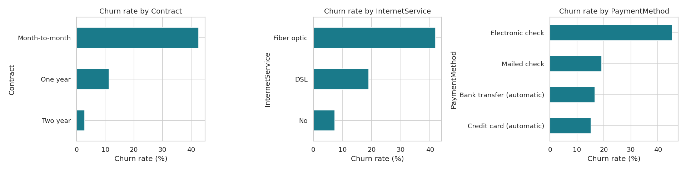
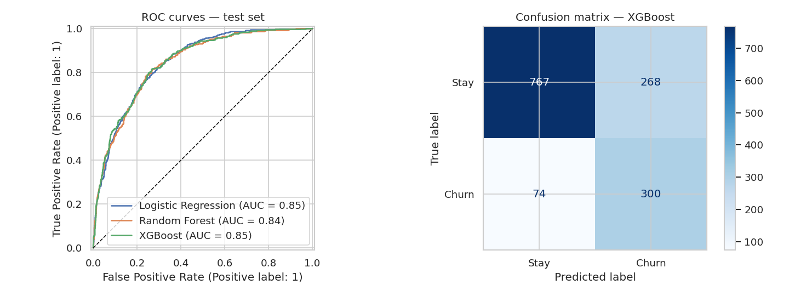
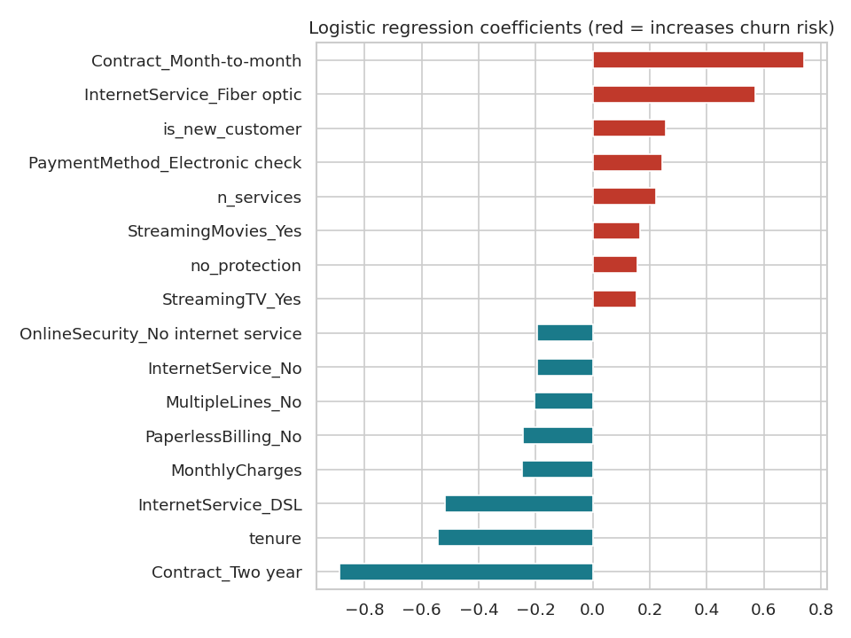

# Customer Churn Prediction — Telco

End-to-end supervised machine learning project: predict which telecom customers are likely to churn, explain **why**, and turn the model into an actionable retention strategy.



## Business question
The retention team can only contact a fraction of the customer base. Which customers should they target, and which levers reduce churn?

## Data
[IBM Telco Customer Churn](https://github.com/IBM/telco-customer-churn-on-icp4d) — 7,043 customers, 20 features (contract, services, billing, tenure, charges), **26.5% churn** (imbalanced target).

## Approach
1. **Cleaning** — `TotalCharges` stored as text; 11 blank values are brand-new customers (tenure = 0) → set to 0.
2. **Exploratory data analysis** — churn rate by segment, tenure and charges distributions.
3. **Feature engineering** — number of subscribed services, tenure groups, average monthly spend, new-customer flag, "no protection" flag (no security & no tech support).
4. **Modeling** — scikit-learn pipelines (scaling + one-hot encoding) comparing a majority-class baseline, Logistic Regression, Random Forest and XGBoost, with class-imbalance handling.
5. **Evaluation** — stratified 5-fold cross-validation on the training set, then a held-out 20% test set. Metrics: ROC-AUC, F1, recall, precision (accuracy is misleading with 26.5% positives).
6. **Interpretation** — logistic regression coefficients and a top-20% targeting simulation.

## Results

**Stratified 5-fold cross-validation (train set, mean ± std)**

| Model | ROC-AUC | F1 | Recall | Precision |
|---|---|---|---|---|
| Baseline (majority class) | 0.500 | 0.000 | 0.000 | 0.000 |
| Logistic Regression | 0.847 ± 0.011 | 0.627 ± 0.021 | 0.791 ± 0.034 | 0.520 ± 0.016 |
| Random Forest | 0.845 ± 0.009 | 0.627 ± 0.026 | 0.714 ± 0.042 | 0.559 ± 0.017 |
| **XGBoost** | **0.848 ± 0.011** | **0.634 ± 0.014** | 0.786 ± 0.023 | 0.531 ± 0.012 |

**Held-out test set (1,409 customers)**

| Model | ROC-AUC | F1 | Recall | Precision |
|---|---|---|---|---|
| Logistic Regression | 0.845 | 0.622 | 0.799 | 0.509 |
| Random Forest | 0.842 | 0.626 | 0.719 | 0.553 |
| **XGBoost** | **0.845** | **0.637** | **0.802** | 0.528 |

- XGBoost detects **80% of churners** on unseen customers (ROC-AUC 0.845, F1 0.64).
- **Targeting:** contacting the **top 20% riskiest customers captures 52% of all churners** — a **2.6× lift** over random targeting.



## Churn drivers


- **Increase risk:** month-to-month contract, fiber-optic internet, first 6 months of tenure, electronic-check payment, no security / tech-support option.
- **Reduce risk:** two-year contract, long tenure, DSL internet.

## Recommendations
- Incentivize month-to-month customers to switch to 1–2 year contracts.
- Reinforce onboarding during the first 6 months.
- Bundle online security / tech support with fiber-optic offers.
- Encourage automatic payment methods.

## Project structure
```
├── data/Telco-Customer-Churn.csv
├── notebooks/churn_prediction.ipynb   # full analysis (executed, with outputs)
├── src/train.py                       # reproducible training script
├── reports/figures/                   # generated charts
└── reports/test_results.csv
```

## Reproduce
```bash
pip install -r requirements.txt
jupyter notebook notebooks/churn_prediction.ipynb   # or: python src/train.py
```
All results use `random_state=42`.

## Next steps
Probability calibration, cost-sensitive decision threshold (retention offer cost vs. customer value), SHAP explanations per customer, and a FastAPI scoring endpoint.

## Tech stack
Python · Pandas · NumPy · scikit-learn · XGBoost · Matplotlib · Seaborn · Jupyter
